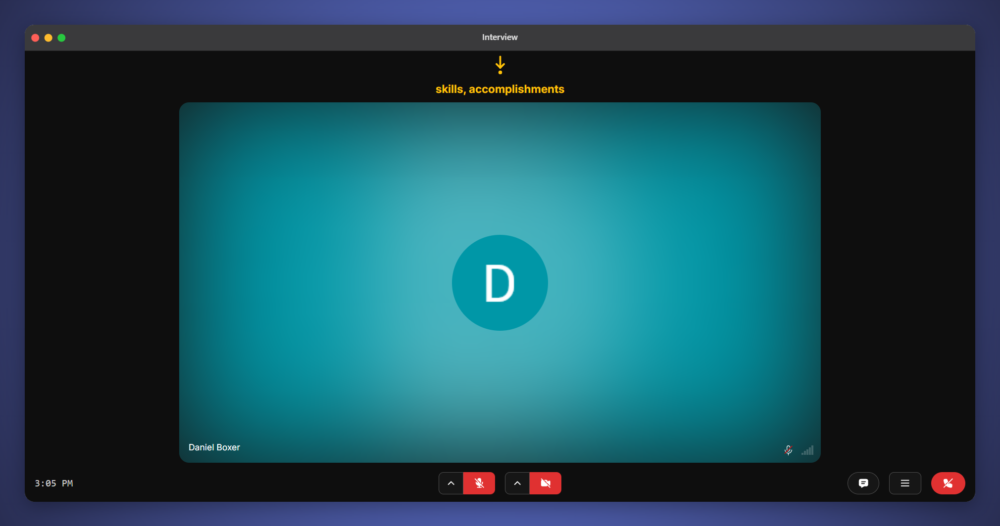
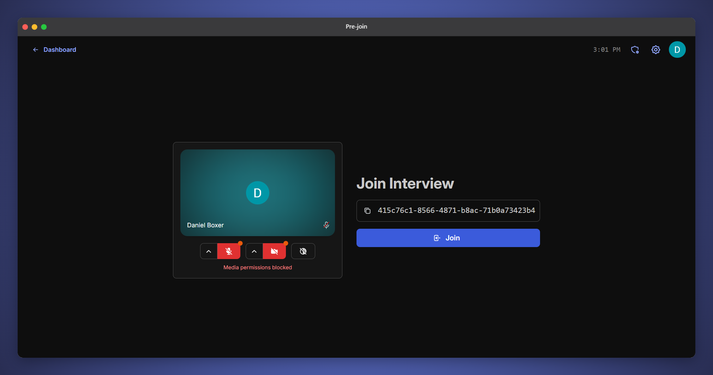
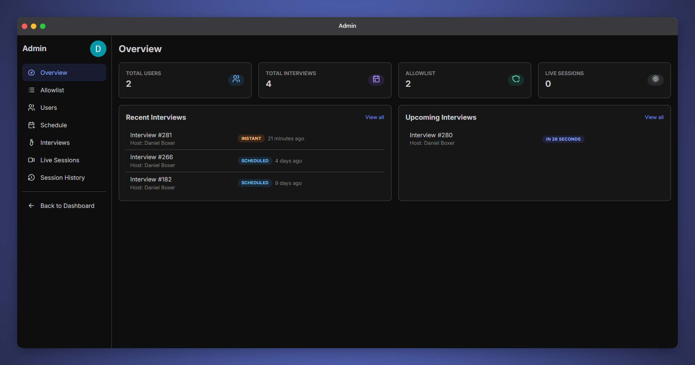
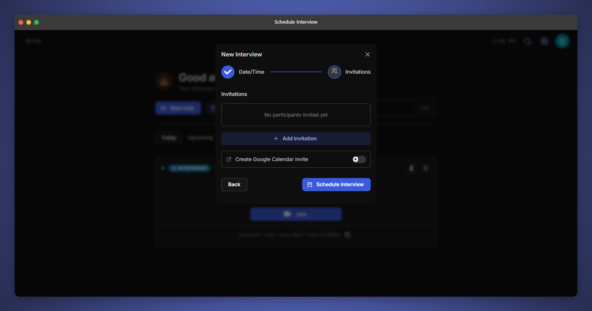
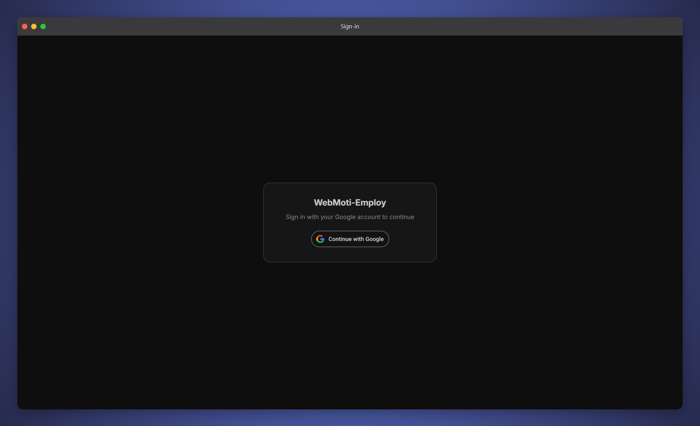
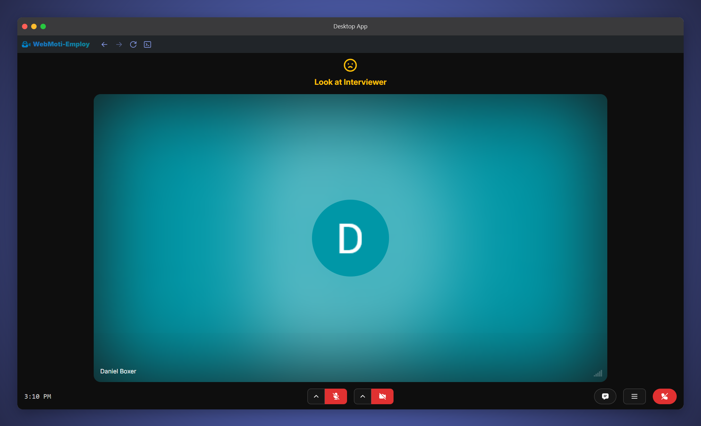

## Dashboard

The dashboard shows your scheduled interviews and allows you to start an interview.

 

## Interview room

The interview room is like a video call. Above the video you can see some AI hints. This was generated in response to the question "What are your strengths".

 

## Pre-join

The Pre-join room allows you to check your media devices before joining the interview.

 

## Admin dashboard

The admin dashboard allows admins to view interview data and to schedule interviews between users.

 

## Chat

 

## Schedule interview

You can invite people to an interview and send them a Google Calendar invite. They will also see the interview in their dashboard.

 

## Sign-in

 

## Desktop app

The Electron desktop app allows you to connect a Tobii eyetracker so you can get eytracking feedback.

 
