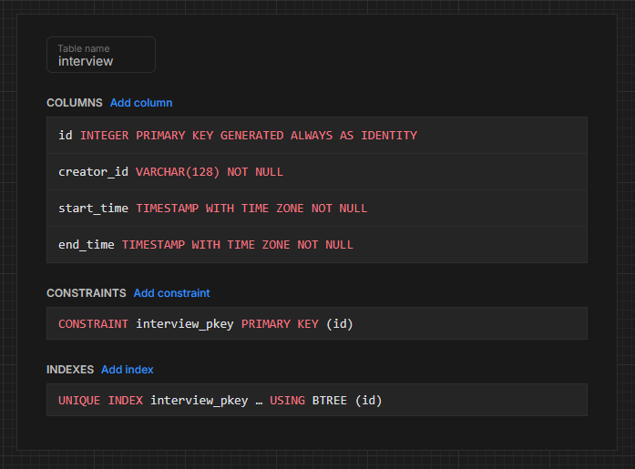
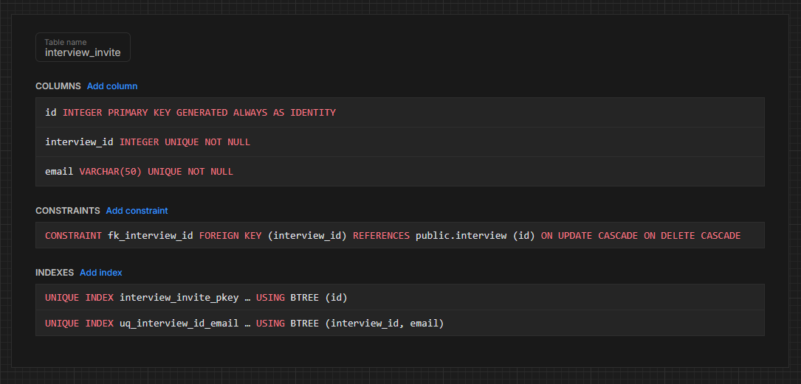

# Web-Employ Server <!-- omit from toc -->

- [Setup](#setup)
  - [Set secrets](#set-secrets)
    - [.dev.vars](#devvars)
    - [.env](#env)
- [Deploying](#deploying)
- [Services](#services)
  - [Video Calling](#video-calling)
  - [Database](#database)
    - [Neon](#neon)
    - [Cloudflare Hyperdrive](#cloudflare-hyperdrive)
  - [Authentication](#authentication)
    - [Setup Allowlist](#setup-allowlist)

## Setup

### Set secrets

#### .dev.vars

First rename `.dev.vars.example` to `.dev.vars`.

Then add secrets:

1. Add `ZOOM_VIDEO_SDK_KEY` and `ZOOM_VIDEO_SDK_SECRET` ([more info](#video-calling))
2. Add `ZOOM_API_KEY` and `ZOOM_API_SECRET` ([more info](#video-calling))
3. Add `CLERK_SECRET_KEY` and `CLERK_PUBLISHABLE_KEY` ([more info](#authentication))
4. Add `DATABASE_URL` (This is for kysely-codegen only (to generate types for the Neon database). Set this to the [Neon database connection string](#neon))

Whenever you change any env variables in `.dev.vars`, run `pnpm run cf-typegen` ([more info here](https://developers.cloudflare.com/workers/wrangler/commands/#types))

#### .env

Rename `.env.example` to `.env`. This hyperdrive variable doesn't get detected in `.dev.vars`, so we need to make a `.env` just for this.

1. Add `WRANGLER_HYPERDRIVE_LOCAL_CONNECTION_STRING_HYPERDRIVE` ([more info](#cloudflare-hyperdrive))

## Deploying

The server is deployed using Cloudflare workers. This also integrates with GitHub.

Steps:

1. Go to cloudflare dashboard
2. Click `Add` > `Workers`
3. Click `Import a repository`
4. Connect to GitHub
5. Set `Root directory` to `/server`
6. Set `Deploy command` to `pnpm run deploy`
7. Set `Build command` to `pnpm run install:deploy`
8. Add `SKIP_DEPENDENCY_INSTALL` Build variable and set to `1` (this skips a full project `pnpm install` and later runs the custom install command above)
9. Create new API token
10. Deploy
11. In `Settings` > `Variables and Secrets`, add everything in `.dev.vars` except `DATABASE_URL` (it's not needed since it's only used for `db-typegen`)
12. Get the deployed server url and set it in Vercel for client as `VITE_API_BASE_URL`
13. [Deploy client](../client/README.md#deploying), get the url, and set `CORS_ORIGIN` secret in Cloudflare

## Services

We use services for hosting, the database, authentication, and video calling.

### Video Calling

We use the Zoom Video SDK for video calling.

Get your [Zoom Video SDK key and secret](https://developers.zoom.us/docs/video-sdk/get-credentials/) from the zoom website. You can also access the API key and API secret right under the SDK values. Note that this is different from the SDK key and is only used for the Zoom Video REST API.

### Database

The database is postgres deployed with the Neon service. We also use Cloudflare hyperdrive to connect to the database.

#### Neon

1. Choose the closest region (Azure East US 2 (Virginia))
2. Create the tables in the public schema:

   
   

3. Create a non owner role to use (replace `<password>` with the actual password) ([More info](https://neon.com/docs/manage/database-access#create-a-read-write-role)) The password should have at least 12 characters with a mix of lowercase, uppercase, number, and symbol characters.

   ```sql
   -- readwrite role
   CREATE ROLE readwrite PASSWORD '<password>';
   GRANT CONNECT ON DATABASE neondb TO readwrite;
   GRANT USAGE, CREATE ON SCHEMA public TO readwrite;
   GRANT SELECT, INSERT, UPDATE, DELETE ON ALL TABLES IN SCHEMA public TO readwrite;
   ALTER DEFAULT PRIVILEGES IN SCHEMA public GRANT SELECT, INSERT, UPDATE, DELETE ON TABLES TO readwrite;
   GRANT USAGE ON ALL SEQUENCES IN SCHEMA public TO readwrite;
   ALTER DEFAULT PRIVILEGES IN SCHEMA public GRANT USAGE ON SEQUENCES TO readwrite;

   -- User creation
   CREATE USER readwrite_imdc WITH PASSWORD '<password>';

   -- Grant privileges to user
   GRANT readwrite TO readwrite_imdc;
   ```

4. Get the connection string. Make sure the role is readwrite_imdc. Put this connection string in `.dev.vars` as the `DATABASE_URL` field.
5. Run `pnpm run db-typegen` to generate types for the database. Do this whenever you change the Neon database.

#### Cloudflare Hyperdrive

<https://developers.cloudflare.com/hyperdrive/get-started/>

1. Login to cloudflare: `npx wrangler login`
2. `npx wrangler hyperdrive create <YOUR_CONFIG_NAME> --connection-string="<MY_CONNECTION_STRING>"` (You get this connection string from the Neon dashboard. Make sure you turn off Connection pooling before copying it: <https://neon.com/blog/hyperdrive-neon-faq#so-should-i-use-hyperdrive-together-with-neons-pooling>) (If you already initialized it, you can update it like this: `npx wrangler hyperdrive update <MY_HYPERDRIVE_ID> --connection-string "<MY_CONNECTION_STRING_WITHOUT_POOLING>"`)
3. Set `WRANGLER_HYPERDRIVE_LOCAL_CONNECTION_STRING_HYPERDRIVE` in `.env` as your local postgres db connection string. You can also set this to the Neon db connection string, but then you need to run the server with `wrangler dev --remote` (note: this env variable ends with `_HYPERDRIVE` since that's what the `hyperdrive` binding is set to in `wrangler.jsonc`)

Disable caching to prevent stale reads:
<https://developers.cloudflare.com/hyperdrive/configuration/query-caching/>

```bash
npx wrangler hyperdrive update my-hyperdrive-id --origin-password my-db-password --caching-disabled true
```

### Authentication

Authentication is done using Clerk.

Get your secret key and publishable key from the clerk dashboard in `Configure` > `API keys`

#### Setup Allowlist

This restricts the app to only people with a TMU Google account.

Note: This is a paid feature and will only work in Clerk developement mode. For production, use [Better Auth](https://www.better-auth.com/) instead of Clerk. In production, you'll also need to make a Google OAuth client and publish it.

1. Go to <https://dashboard.clerk.com/last-active?path=user-authentication/restrictions>
2. In the Allowlist section, toggle on Enable allowlist.
3. Add `torontomu.ca` to the allowlist
4. Save changes
